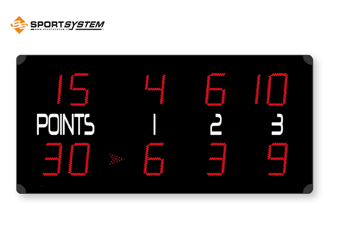

<h1 align="center"> tennis-board </h1>

<p align="center">
  
</p>

Веб-приложение, реализующее табло счёта теннисного матча.
(аналог виртуальной доски для судей)

# Настройка базы данных

Приложение использует PostgreSQL.

Параметры подключения к базе данных не хранятся в исходном коде. Для локального запуска используется внешний конфигурационный файл `database.properties`, а для деплоя на сервер — системные свойства Java (`-D...`).

---

## Локальный запуск

### 1. Создайте базу данных

Создайте пустую базу данных PostgreSQL.

Например:

```text
tennis_board
```

Это можно сделать через pgAdmin, DBeaver, IntelliJ IDEA Database tool или через консоль PostgreSQL.

---

### 2. Создайте таблицы

Выполните SQL-скрипт:

```text
src/main/resources/schema.sql
```

Скрипт создаёт таблицы, первичные ключи, внешние ключи и остальные ограничения.

При необходимости также выполните скрипт с тестовыми данными:

```text
src/main/resources/data.sql
```

---

### 3. Подготовьте локальный конфиг

Перейдите в папку:

```text
src/main/resources/
```

Скопируйте файл-шаблон:

```text
database.properties.origin
```

и назовите копию строго:

```text
database.properties
```

В файле `database.properties` укажите свои локальные настройки PostgreSQL:

```properties
db.url=jdbc:postgresql://localhost:5432/tennis_board
db.username=postgres
db.password=your_password
db.pool.size=20
```

Файл `database.properties` добавлен в `.gitignore`, поэтому локальные логины и пароли не попадут в Git.

В репозитории должен храниться только шаблон `database.properties.origin`.

---

### 4. Запустите приложение локально

Соберите проект через Maven:

```bash
mvn clean package
```

После этого запустите приложение на локальном Tomcat через IntelliJ IDEA.

---

## Деплой на сервер

При деплое на сервер не нужно зашивать пароль от базы данных внутрь `.war`-файла.

Для серверного окружения параметры подключения можно передать через системные свойства Java:

```text
-Ddb.url
-Ddb.username
-Ddb.password
-Ddb.pool.size
```

Если эти свойства переданы при запуске, приложение использует их вместо локальных значений из `database.properties`.

---

## Настройка внешнего Tomcat

Для деплоя `.war` в полноценный Tomcat удобно передавать настройки через `CATALINA_OPTS`.

Создайте или отредактируйте файл:

```text
/opt/tomcat/bin/setenv.sh
```

Добавьте туда:

```bash
export CATALINA_OPTS="$CATALINA_OPTS \
-Ddb.url=jdbc:postgresql://localhost:5432/tennis_board \
-Ddb.username=postgres \
-Ddb.password=your_server_password \
-Ddb.pool.size=20"
```

После изменения настроек перезапустите Tomcat:

```bash
sudo systemctl restart tomcat
```

---

## Важно!

Не коммитьте файл:

```text
src/main/resources/database.properties
```

В репозитории должен храниться только шаблон:

```text
src/main/resources/database.properties.origin
```

Так в Git не попадут реальные логины, пароли и серверные настройки.

## 📚 Учебные материалы по JPA / Hibernate

В репозитории сохранена отдельная учебная ветка с разбором базовых тем JPA/Hibernate:

- работа с `EntityManager`;
- `persist`, `find`, JPQL-запросы;
- разница между SQL и JPQL;
- однонаправленная связь `BookEntity -> AuthorEntity`;
- поиск через `join`;
- обработка сценария "не найдено" через `Optional`;
- учебный разбор проблемы N+1 и расчёты нагрузки.

Основные конспекты находятся прямо в комментариях к классам `BookDao` и `BookService`.

Чтобы переключ через `Optional`;
- учебный разбор проблемы N+1 и расчёты нагрузки.

Основныеиться на учебную ветку:

```bash
git checkout jpa-study-notes

## Контакты

Автор: [@timk01](https://github.com/timk01)
Телеграмм: https://t.me/tim_matv
