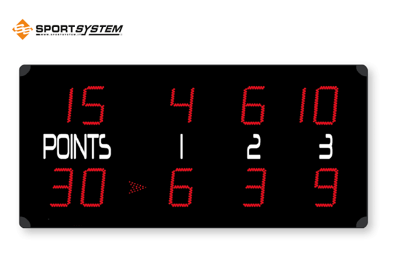

<h1 align="center"> tennis-board </h1>

<p align="center">
  
</p>

Веб-приложение, реализующее табло счёта теннисного матча.

Приложение позволяет:

* создать новый матч;
* вести счёт текущего матча;
* автоматически считать очки, геймы, сеты и tie-break;
* завершать матч и сохранять результат в БД;
* просматривать список завершённых матчей;
* искать завершённые матчи по имени игрока;
* листать список завершённых матчей постранично.

Проект реализован на **Java 21** с использованием **Spring MVC**, **Hibernate/JPA**, **PostgreSQL**, **Apache Tomcat 10**, **Maven**, **MapStruct**, **Lombok**, **SLF4J + Logback**.

---

## Содержание

* Быстрый старт
* API
* Детали реализации
* Архитектурные замечания
* Тесты
* Важные замечания
* Контакты

---

<details>
  <summary><strong>Быстрый старт</strong></summary>

## Быстрый старт

### Требования

Перед запуском должны быть установлены:

* JDK 21
* Maven
* PostgreSQL
* Apache Tomcat 10

Проект использует `jakarta.servlet`, поэтому для локального запуска и деплоя нужен **Tomcat 10**.

Удаленно проект можно посмотреть по адресу:

```text
http://77.221.141.215:8081
```

---

### 1. Создать базу данных

Создайте пустую базу данных PostgreSQL, например:

```text
tennis_board
```

---

### 2. Создать таблицы

Выполните SQL-скрипт:

```text
src/main/resources/schema.sql
```

При необходимости можно также выполнить скрипт с начальными данными:

```text
src/main/resources/data.sql
```

Скрипт `schema.sql` создаёт таблицы, первичные ключи, внешние ключи, ограничения и индекс по имени игрока.

---

### 3. Подготовить конфиг БД

В папке:

```text
src/main/resources/
```

скопируйте шаблон:

```text
database.properties.origin
```

и назовите копию:

```text
database.properties
```

Пример локальных настроек:

```properties
db.driver.name=org.postgresql.Driver
db.url=jdbc:postgresql://localhost:5432/YOUR_DATABASE_NAME
db.username=YOUR_USERNAME
db.password=YOUR_PASSWORD
db.pool.size=20

hibernate.dialect=org.hibernate.dialect.PostgreSQLDialect
hibernate.hbm2ddl.auto=none
hibernate.show_sql=true
hibernate.format_sql=true
```

Файл `database.properties` не должен попадать в Git. В репозитории хранится только шаблон `database.properties.origin`.

---

### 4. Собрать проект

```bash
mvn clean package
```

После сборки WAR-файл будет находиться в папке:

```text
target/
```

---

### 5. Запустить локально

Запустите приложение на локальном Tomcat 10 через IntelliJ IDEA.

При запуске через Tomcat удобно указывать application context `/`, чтобы приложение было доступно по адресу:

```text
http://localhost:8080/
```

</details>

---

<details>
  <summary><strong>API</strong></summary>

## API

Все ошибки API возвращаются в едином формате:

```json
{
  "message": "error message"
}
```

### Создание матча

```http
POST /matches
```

Тело запроса:

```json
{
  "firstPlayerName": "roger",
  "secondPlayerName": "rafael"
}
```

Успешный ответ:

```json
{
  "id": "match-uuid"
}
```

---

### Получение текущего счёта матча

```http
GET /matches/{uuid}
```

Ответ возвращается в плоском формате, без вложенных объектов игроков:

```json
{
  "firstPlayerName": "roger",
  "secondPlayerName": "rafael",
  "firstPlayerPoints": 15,
  "secondPlayerPoints": 30,
  "firstPlayerGames": 2,
  "secondPlayerGames": 1,
  "firstPlayerSets": 0,
  "secondPlayerSets": 0,
  "firstPlayerTieBreakPoints": null,
  "secondPlayerTieBreakPoints": null,
  "winnerName": null
}
```

Такой формат выбран осознанно: frontend получает сразу готовые поля для отображения табло, без дополнительного разбора вложенных структур.

---

### Начисление очка игроку

```http
POST /matches/{uuid}/point
```

Тело запроса:

```json
{
  "name": "roger"
}
```

После каждого начисления очка возвращается актуальный счёт матча.

Если матч завершён, он удаляется из хранилища текущих матчей и сохраняется в БД как finished match.

---

### Получение завершённых матчей

```http
GET /matches?page=1&player_name=roger
```

Параметры:

```text
page — номер страницы, начиная с 1
player_name — необязательный фильтр по имени игрока
```

Успешный ответ:

```json
{
  "matches": [
    {
      "firstPlayerName": "roger",
      "secondPlayerName": "rafael",
      "winnerName": "roger"
    }
  ],
  "currentPage": 1,
  "totalPages": 3
}
```

</details>

---

<details>
  <summary><strong>Детали реализации</strong></summary>

## Различные детали внутренней реализации

### Spring MVC без Spring Boot

Проект реализован на Spring MVC без Spring Boot.

Конфигурация выполняется через Java config:

* `WebApplicationInitializer`;
* `@EnableWebMvc`;
* `@ComponentScan`;
* `JpaConfig`;
* `WebConfig`.

---

### Текущие матчи

Текущие матчи хранятся в памяти приложения.

Для хранения используется потокобезопасная структура:

```text
ConcurrentHashMap<UUID, Match>
```

`ConcurrentHashMap` защищает само хранилище, но не делает mutable-объект `Match` потокобезопасным. Поэтому изменение счёта и снятие snapshot выполняются внутри `synchronized(match)`.

---

### Завершённые матчи

Завершённые матчи сохраняются в PostgreSQL.

Для работы с БД используются:

* Hibernate/JPA;
* `EntityManager`;
* Spring transactions;
* PostgreSQL constraints;
* HikariCP connection pool.

В БД добавлены ограничения:

```text
players.name — varchar(100) not null + unique index
matches.player1 — foreign key + not null
matches.player2 — foreign key + not null
matches.winner — foreign key + not null
player1 <> player2
winner = player1 or winner = player2
```

---

### DTO и MapStruct

Контроллеры не работают напрямую с JPA Entity.

Для внешних ответов используются response DTO, а преобразование между внутренними объектами и DTO выполняется через MapStruct.

DTO не содержат JPA Entity.

---

### Ошибки

Ошибки приложения обрабатываются через `GlobalExceptionHandler`.

Известные application exceptions преобразуются в HTTP-ответы с понятным статусом и JSON body.

Неизвестные исключения логируются как server-side errors и возвращаются как:

```json
{
  "message": "Unknown exception"
}
```

</details>

---

<details open>
  <summary><strong>Архитектурные замечания</strong></summary>

## Архитектурные замечания

### MatchScore

Основная логика подсчёта очков находится в доменной модели `MatchScore`, а не в сервисном слое.

`MatchService` только координирует сценарий:

```text
найти матч -> определить сторону игрока -> начислить очко -> сохранить finished match при завершении
```

При этом `MatchScore` осознанно оставлен единым классом для подсчёта:

```text
game / set / tie-break / match result
```

как осознанный архитектурный компромисс.

---

### Формат ответа текущего счёта

Ответ `GET /matches/{uuid}` сделан плоским: имена игроков, очки, геймы, сеты, tie-break points и winner возвращаются отдельными полями.
(по ТЗ на момент создания проекта)

</details>

---

<details>
  <summary><strong>Тесты</strong></summary>

## Тесты

Основная бизнес-логика подсчёта очков покрыта unit-тестами, добавлены тесты на сервисы и интеграционные тесты для проверки всего приложения.

По логике, проверются базовые сценарии:

* обычный счёт 0 / 15 / 30 / 40;
* deuce;
* advantage;
* выигрыш гейма;
* выигрыш сета;
* tie-break;
* завершение матча;
* сохранение завершённых матчей;
* поиск и пагинация finished matches.

Для проверки:

```bash
mvn clean test
```

</details>

---


<details>
  <summary><strong>Важные замечания</strong></summary>

## Важные замечания

* Проект использует Tomcat 10, потому что основан на `jakarta.servlet`.
* Приложение деплоится как `ROOT.war`, поэтому доступно без дополнительного context path.
* Реальные параметры подключения к БД не должны попадать в Git.
* `database.properties` должен быть локальным файлом окружения.
* Текущие матчи хранятся в памяти приложения, поэтому при перезапуске Tomcat ongoing matches (незавершенные) будут потеряны.
* Завершённые матчи сохраняются в PostgreSQL.
* Схема БД создаётся SQL-скриптами; Flyway/Liquibase не используются, так как не входили в требования проекта.

</details>

---

## Контакты

Автор: [@timk01](https://github.com/timk01)  
Телеграмм: https://t.me/tim_matv
